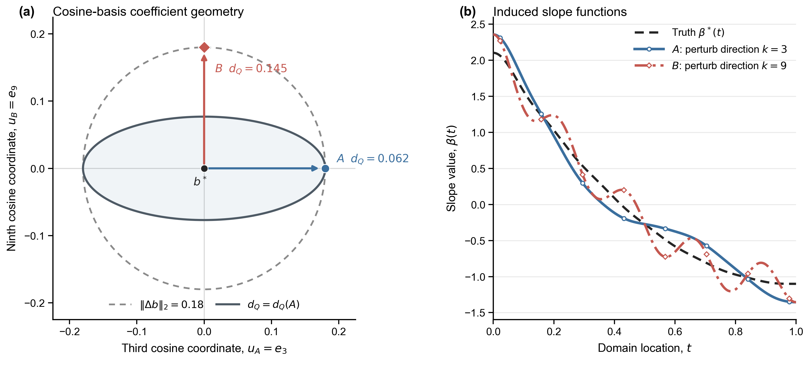
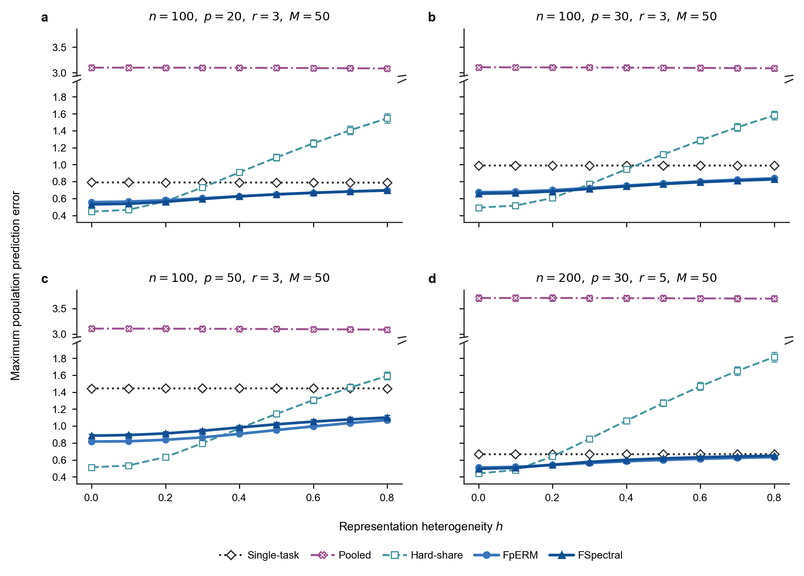
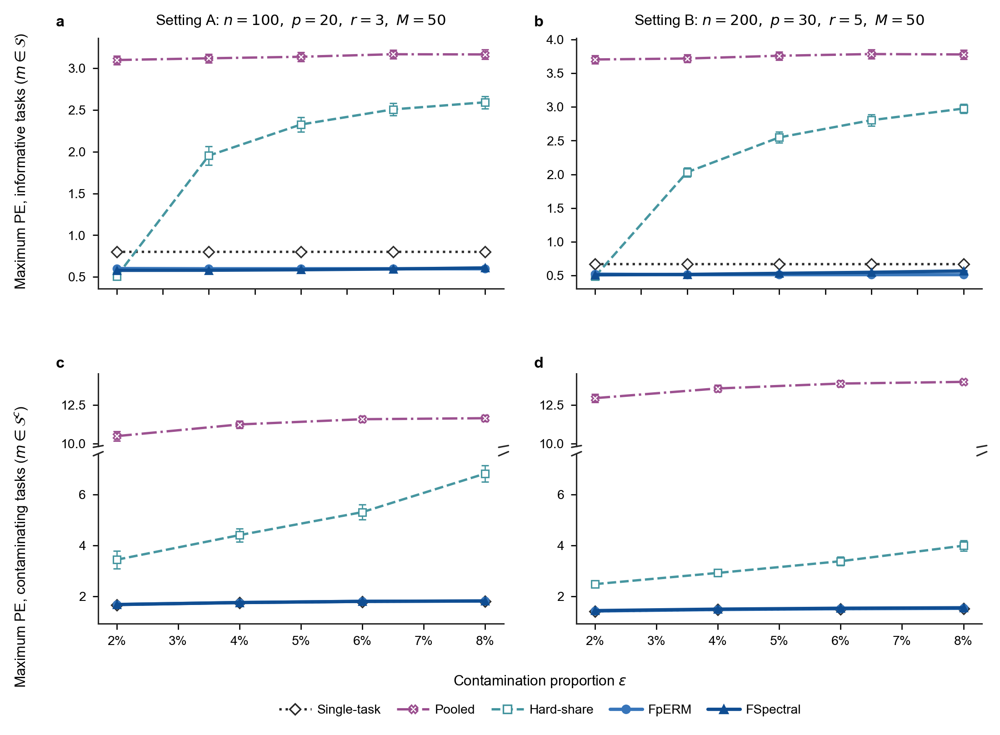
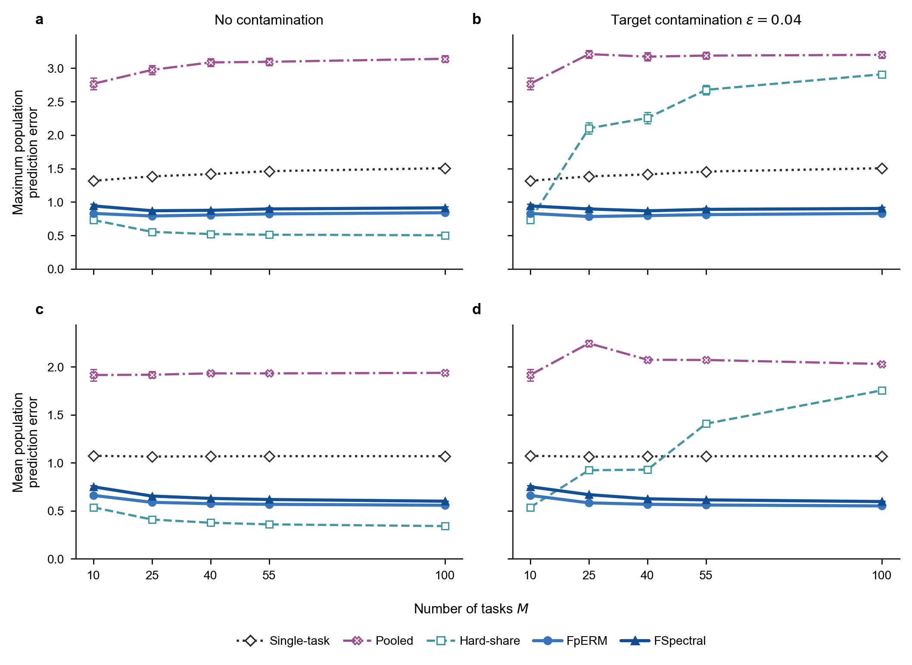

## Motivation

Consider a wearable device that records daily curves such as heart rate, blood pressure, and activity intensity; the same data structure appears when a monitoring station records pollutant trajectories or a laboratory measures multiple chemical spectra. Treating these observations as functions preserves temporal or spectral structure that isolated measurements discard. Because a single site, population, or laboratory often has limited samples, a natural research goal is to build a model with multiple functional covariates and use valid information from related source tasks to improve prediction.

## Challenge

This goal brings several challenges. Functional predictors are smooth objects, so functional regression is an ill-posed infinite-dimensional estimation problem. At the same time, information from multiple sources is not uniformly useful: heterogeneous tasks can cause negative transfer.

- **Model the shared structure without making all tasks identical.** We need a representation that captures how tasks are related while retaining task-specific variation.

- **Reduce the infinite dimension in the right geometry.** A finite basis is needed for computation, but the reduction must balance smoothness with prediction accuracy rather than merely compare coefficient vectors.

- **Transfer information safely.** The estimation procedure must exploit informative tasks and still protect a target task when the learned common structure is inaccurate or contaminated by unrelated tasks.

The model, method, and theory below are organized as direct answers to these three challenges.

## Model

Consider $M$ independent regression tasks. For simplicity, let each task contain $n$ observations. The scalar-on-multiple-function model for task $m$ is

$$Y_i^{(m)}
=
\sum_{j=1}^{p}\int_{\mathcal T}X_{ij}^{(m)}(t)\beta_j^{*(m)}(t)\,dt
+\varepsilon_i^{(m)},
\qquad i\in[n],\quad m\in[M].$$

The $p$ slope functions are assumed to be linearly spanned by $r\le p$ latent slope functions:

$$\boldsymbol\beta^{*(m)}(t)
=
\boldsymbol A^{*(m)}\boldsymbol\alpha^{*(m)}(t),
\qquad
\boldsymbol A^{*(m)}\in\mathbb O^{p\times r}.$$

Here, $\boldsymbol A^{*(m)}$ characterizes the low-dimensional representation along the coordinates of the observed functions, while $\boldsymbol\alpha^{*(m)}(t)$ captures temporal variation in the latent representation space. Because $\boldsymbol A^{*(m)}$ is identifiable only up to rotation, the meaningful object is its column space, or equivalently the projector $\boldsymbol A^{*(m)}\boldsymbol A^{*(m)\top}$.

Let $\mathcal S\subseteq[M]$ be the unknown set of informative tasks. Their representations are similar, rather than necessarily identical, when

$$\min_{\bar{\boldsymbol A}\in\mathbb O^{p\times r}}
\max_{m\in\mathcal S}
\left\|
\boldsymbol A^{*(m)}\boldsymbol A^{*(m)\top}
-
\bar{\boldsymbol A}\bar{\boldsymbol A}^{\top}
\right\|_{\mathrm{op}}
\le h,
\qquad
\epsilon=\frac{|\mathcal S^c|}{M}.$$

The matrix $\bar{\boldsymbol A}$ is a central representation, $h$ measures representation heterogeneity, and $\epsilon$ is the proportion of unrelated or contaminated tasks. Thus, the model encodes similarity as a continuum: $h=0$ gives exact sharing, while $h>0$ allows task-specific deviations; tasks in $\mathcal S^c$ need not follow the low-dimensional structure at all.

This answers the first challenge at the structural level. We **share a low-dimensional subspace across informative tasks**, not the complete slope functions, and we explicitly leave room for both **heterogeneity and contamination.**

## Method

### 1. Reduce the infinite dimension while preserving functional geometry

Let $\boldsymbol\psi_K(t)$ be a shared B-spline basis and write a working slope function as

$$\boldsymbol\beta_{\boldsymbol B}(t)
=
\boldsymbol B\boldsymbol\psi_K(t),
\qquad \boldsymbol B\in\mathbb R^{p\times K}.$$

With $\boldsymbol Z_i^{(m)}=\int_{\mathcal T}\boldsymbol X_i^{(m)}(t)\boldsymbol\psi_K(t)^{\top}\,dt$, estimation becomes finite-dimensional through the penalized loss

$$L_\eta^{(m)}(\boldsymbol B)
=
\frac{1}{2n}\sum_{i=1}^{n}
\left\{Y_i^{(m)}-\langle\boldsymbol Z_i^{(m)},\boldsymbol B\rangle_{\mathrm F}\right\}^{2}
+\frac{\eta}{2}\operatorname{tr}
\left(\boldsymbol B\boldsymbol R_K\boldsymbol B^{\top}\right).$$

The basis expansion makes computation tractable, while the roughness penalty stabilizes the original ill-posed problem. But the coefficient matrix alone does not describe whether two fitted functions behave similarly for prediction. We therefore measure discrepancy in the **prediction–roughness geometry**

$$\|\boldsymbol\beta\|_{X^{(m)},\eta}^{2}
=
\|\boldsymbol\beta\|_{X^{(m)}}^{2}
+\eta\|\boldsymbol\beta\|_{R}^{2},$$

and use its empirical analogue $\|\boldsymbol\beta_{\boldsymbol B}\|_{n,\eta}^{(m)}$ in the algorithms. The prediction component depends on the covariance structure of the functional predictors; the roughness component suppresses unstable high-frequency directions.

{#fig-geometry fig-alt="Comparison of Euclidean coefficient geometry and prediction-roughness geometry for two equal-size perturbations." width="100%"}

This geometry is the **link between dimensionality reduction and the final statistical objective**: we reduce to spline coefficients, but continue to compare functions according to their consequences for prediction and smoothness.

### 2. Functional penalized empirical risk minimization

FpERM first **learns all tasks jointly**. Its penalty encourages each task-specific representation subspace to stay close to a common center while still allowing the subspaces to differ:

$$\min_{\bar{\boldsymbol A},\{\boldsymbol A^{(m)},\boldsymbol\Theta^{(m)}\}}
\frac{1}{M}\sum_{m=1}^{M}
\left[
L_\eta^{(m)}\!\left(\boldsymbol A^{(m)}\boldsymbol\Theta^{(m)}\right)
+\frac{\lambda_A}{\sqrt n}
\left\|
\boldsymbol A^{(m)}\boldsymbol A^{(m)\top}
-\bar{\boldsymbol A}\bar{\boldsymbol A}^{\top}
\right\|_{\mathrm{op}}
\right].$$

This step produces a task-specific anchor $\widetilde{\boldsymbol\beta}^{(m)}$. FpERM then performs a **biased refitting** using only task $m$:

$$\widehat{\boldsymbol B}_{J}^{(m)}
\in
\arg\min_{\boldsymbol B}
\left\{
L_\eta^{(m)}(\boldsymbol B)
+\frac{\gamma_J}{\sqrt n}
\left\|
\boldsymbol\beta_{\boldsymbol B}-\widetilde{\boldsymbol\beta}^{(m)}
\right\|_{n,\eta}^{(m)}
\right\}.$$

The joint step borrows information, but the refitting step allows the estimator to move away from the anchor when the task-specific data support that move. In this way, similarity is used as information rather than imposed as an exact constraint, and refitting guards against negative transfer.

### 3. Functional spectral aggregation

To motivate the procedure, consider first the ideal case in which $h=0$ and $\mathcal S=[M]$. In this case, all tasks share the same representation subspace. Since the representation matrices are identifiable only up to rotations, the task-specific rotations may be absorbed into the latent coefficient matrices, so that $B_K^{*(m)} = \bar{ A}\Theta_K^{*(m)}, m\in[M]$. Consequently, $\left[B_K^{*(1)},\ldots, B_K^{*(M)}\right]=\bar{ A}\left[\Theta_K^{*(1)},\ldots,\Theta_K^{*(M)}\right].$ If the concatenated low-dimensional coefficient matrix on the right-hand side has rank $r$, then the concatenated population coefficient matrix has rank $r$, and its column space coincides with $\operatorname{col}(\bar{ A})$. Hence, at the population level, the leading $r$ left singular vectors of the concatenated coefficient matrix recover the central representation subspace. FSpectral provides a computationally simpler route to the same goal:

1.  fit a penalized functional pilot estimator separately for each task;

2.  rescale each pilot using the empirical temporal Gram matrix, reducing the influence of weakly observed temporal directions;

3.  truncate unusually large standardized pilot blocks so that a few outlier tasks cannot dominate the aggregation;

4.  concatenate the blocks and use the leading $r$ left singular vectors to estimate the central representation subspace;

5.  refit each task within that subspace, then apply the same task-specific prediction–roughness refitting used by FpERM.

The sequence can be summarized as

$$\text{taskwise pilots}
\;\longrightarrow\;
\text{temporal rescaling}
\;\longrightarrow\;
\text{truncation}
\;\longrightarrow\;
\text{SVD}
\;\longrightarrow\;
\text{task-specific refitting}.$$

Temporal rescaling answers the functional-geometry problem, truncation protects the shared representation from unusually large outlier tasks, and the final refitting supplies the same protection against negative transfer. The trade-off is that FSpectral requires an upper bound $\bar\epsilon$ on the contamination proportion to choose its truncation level.

## Theory

The functional predictors do not have the same geometry as an ordinary finite-dimensional design. We therefore first characterize the approximation and stochastic geometry generated jointly by the functional covariance and the roughness penalty. After an appropriate task-specific change of temporal coordinates, the prediction form becomes Euclidean and the roughness penalty is diagonal with weights $\gamma_k^{(m)}$; this leads to the effective temporal dimension

$$d_K^{(m)}(\eta)
=
\sum_{k=1}^{K}\frac{1}{1+\eta\gamma_k^{(m)}},$$

which counts the temporal directions that remain effectively active after regularization. This tool lets us compare empirical and population prediction–roughness geometry and replace the nominal basis dimension $K$ by an effective complexity $d_K(\eta)$.

The resulting prediction-error bounds separate cross-task representation estimation, estimation within the learned $r$-dimensional space, spline approximation, representation heterogeneity $h$, and contamination $\epsilon$. For both estimators, the bound has the schematic form

$$\text{multi-task rate}\bigl(M,r,d_K(\eta),h,\epsilon\bigr)
\;\wedge\;
\text{single-task rate}\bigl(p,d_K(\eta)\bigr).$$

The first branch becomes smaller when more informative tasks are available and the intrinsic dimension $r$ is much smaller than $p$; the terms involving $h$ and $\epsilon$ quantify when this benefit is weakened. The second branch formalizes the safe-net supplied by task-specific refitting. FSpectral has a sharper dependence on $r$, whereas FpERM has the stronger robustness guarantee against task contamination.

## Experiment

The experiments follow the same decomposition as the theory. Rather than only reporting that the proposed methods work, each experiment varies one quantity that controls whether sharing should help: $h$, $\epsilon$, or $M$.

### Representation heterogeneity (h)

With no contamination, $h$ varies from 0 to 0.8. Hard-share performs well when $h$ is small, but its prediction error increases rapidly as $h$ grows because its exact common-representation assumption becomes wrong. FpERM and FSpectral increase much more slowly and remain below the Single-task benchmark across the four settings, supporting the decision to model representations as similar rather than identical.

{#fig-h fig-alt="Four-panel line chart comparing five methods as representation heterogeneity h increases." width="100%"}

### Contamination proportion $\epsilon$

Next, $h=0.1$ is fixed and unrelated tasks are introduced. Pooled and Hard-share deteriorate substantially because outlier tasks distort the shared fit. In contrast, FpERM and FSpectral remain stable on informative tasks and stay close to Single-task on contaminating tasks, matching the intended role of truncation and task-specific refitting. The closer comparison also shows FpERM remaining more stable than FSpectral in the harder setting, consistent with its stronger theoretical contamination guarantee.

{#fig-epsilon fig-alt="Four-panel line chart comparing five methods on informative and contaminating tasks as epsilon increases." width="100%"}

### Number of tasks $M$

Finally, $M$ varies from 10 to 100. Without contamination, adding tasks improves the methods that learn a common representation. With $\epsilon=0.04$, Hard-share deteriorates as more outliers enter its common representation, while FpERM and FSpectral remain stable in maximum error and continue to improve in mean error. More tasks are therefore useful only when the aggregation mechanism can distinguish shared signal from heterogeneous sources.

{#fig-M fig-alt="Four-panel line chart comparing five methods as the number of tasks M increases under clean and contaminated settings." width="100%"}

### Empirical validation

We apply the methods to the Beijing Multi-Site Air Quality data set. The 12 monitoring stations and four seasons define $M=48$ tasks; the response is daily mean PM2.5, and the functional predictors are 24-hour curves of PM10, SO2, NO2, CO, O3, temperature, pressure, dew point, rain, and wind speed. This setting mirrors the motivation: each task has limited observations, but the monitoring sites may share related functional effects.

| $r$ | Single | Pooled | Hard-share | FSpectral |     FpERM |
|----:|-------:|-------:|-----------:|----------:|----------:|
|   2 |  32.39 |  24.57 |  **15.38** |     28.23 |     17.81 |
|   3 |  32.39 |  24.57 |      17.02 |     30.66 | **15.76** |

: Average task RMSE for daily mean PM2.5.

Relative to Single, FpERM reduces average task RMSE by 45.0% when $r=2$ and 51.3% when $r=3$; paired calendar-block bootstrap intervals for these improvements exclude zero. Hard-share is best at $r=2$, whereas FpERM is best at $r=3$, showing that the value of exact versus approximate sharing can depend on the representation dimension. This experiment confirms the **existence of a shareable low-rank representation structure among the multi-functional predictors**, enabling our method to attain the desired objective. The second algorithm, however, exhibited inferior performance. Our exploration indicates that **this is attributable to the sparsity of the precipitation variable, which renders it difficult to estimate in the single-task setting and consequently undermines the performance of the second algorithm.**

## Discussion

The main lesson is not simply that more tasks produce better estimates. The problem is to decide **what** should be shared, **how much** it should be shared, and **how** a task can recover when the shared information is wrong.

First, the shareable object is a low-dimensional representation subspace rather than the complete slope function. Measuring similarity between projectors makes that object identifiable and turns exact sharing into the special case $h=0$. Second, functional reduction cannot be separated from functional geometry: spline coefficients make the problem finite, but covariance and roughness determine which coefficient errors matter for prediction. Third, transfer and protection must be designed together. FpERM and FSpectral learn across tasks, while task-specific refitting gives each task a principled route back toward its own data.

The two procedures emphasize different priorities. FSpectral is computationally simpler and achieves a sharper dependence on the intrinsic representation dimension; FpERM is more robust to task contamination. Across both methods, the full reasoning chain is the same: represent shared structure without enforcing identity, regularize in the geometry of the functional problem, isolate the failure modes through $h$, $\epsilon$, and $M$, and retain a single-task safe-net when transfer is not beneficial.
